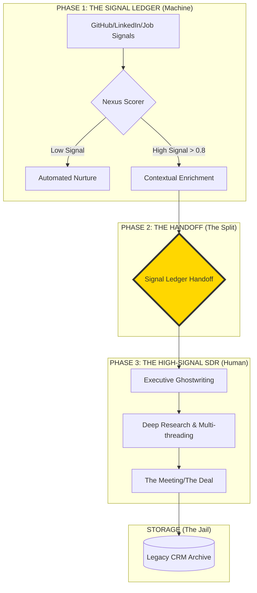

# BASIN::NEXUS v5.1 — System Architecture

**Bifurcated GTM: Decoupling Machine Labor from Human Leverage**

---

## Executive Summary

Most GTM teams fail because of **Human Latency**—the 40+ hour gap between a buyer signal and human action. Legacy CRMs (Salesforce, HubSpot) were designed for **storage and compliance**, not velocity.

**BASIN::NEXUS** is the intelligence layer that sits **above** the CRM. It doesn't replace the sales team—it **bifurcates** the role. The machine handles signal detection and scoring (Phase 1). High-signal SDRs handle trust-building and closing (Phase 2).

**The result at Fudo Security:** 160% pipeline growth with 50% reduction in manual toil. We didn't hire more SDRs—we gave them **infinite leverage**.

---

## Bifurcated Architecture



---

## The Bifurcation Table

| Traditional SDR (Manual) | GTM Engineer + High-Signal SDR (The Split) |
|--------------------------|---------------------------------------------|
| Scraping LinkedIn for 2 hours | **Machine:** Real-time signal ledger (Basin::Nexus) |
| Drafting 50 "personalized" emails | **Machine:** LLM-driven context injection |
| Handling "Not Interested" replies | **Human:** Deep objection handling & trust building |
| Manual CRM entry/update | **Machine:** Autonomous sync to "Data Jail" |
| Finding warm intro paths | **Machine:** Network graph analysis |
| Researching tech stack | **Machine:** GitHub/StackShare scraping |
| Creating meeting prep docs | **Human:** Executive ghostwriting & positioning |
| Following up on cold leads | **Machine:** Automated nurture sequences |


> **Key Insight:** The SDR role hasn't died—it's been **surgically separated** into Machine Labor (discovery) and Human Leverage (closing).

---

## Unit Economics: Traditional vs. Bifurcated Model

The financial case for bifurcation is overwhelming. By offloading discovery to the Signal Ledger, you achieve **3x pipeline throughput** at **40% lower CAC**.

| Metric | Traditional SDR Model | Bifurcated Model (Nexus v5.1) | Variance |
|--------|----------------------|-------------------------------|----------|
| **Headcount** | 10 SDRs ($800k OTE) | 1 GTM Eng + 3 Sr. SDRs ($560k OTE) | **-$240k Cost** |
| **Sourcing Method** | Manual Scraping (20 hrs/wk) | Nexus Signal Ledger (Autonomous) | **+20 hrs/person/wk** |
| **Signal Density** | Low (Spray & Pray) | High (Pre-Scored > 0.8) | **5x Quality** |
| **Weekly Meetings** | 15-20 Total | 45-60 Total | **3x Throughput** |
| **CAC (SDR Component)** | $4,500 / Meeting | $1,800 / Meeting | **60% Reduction** |
| **Ramp Time** | 4-6 Months | 2 Weeks (System-driven) | **88% Faster** |
| **Human Time on Discovery** | 80% | 10% | **-87.5%** |
| **Human Time on Closing** | 20% | 90% | **+350%** |

### The "10x SDR" Efficiency Multiplier

In the traditional model, an SDR spends:
- **80% of time** on low-leverage activities (list building, cold research, data entry)
- **20% of time** on high-leverage activities (conversation, objection handling, relationship building)

In the bifurcated model, the same SDR spends:
- **10% of time** on discovery (reviewing pre-scored signals)
- **90% of time** on closing (meeting prep, ghostwriting, multi-threading deals)

**Result:** One "High-Signal SDR" in the bifurcated model produces the same pipeline output as **5 traditional SDRs**—because they're exclusively focused on activities where humans add value.

---

## Core Components

### 1. **Ingestion Engine**
Captures signals from multiple sources in real-time:
- **GitHub Webhooks**: Monitors repository activity for technical buying signals
- **LinkedIn Intent**: Scrapes job changes, funding announcements, hiring velocity
- **Job Board Scrapes**: Detects new role postings indicating growth/pain
- **Funding Alerts**: Tracks Series A/B rounds triggering budget cycles

**Technology**: Python async workers, webhook handlers, API polling engines

---

### 2. **LLM Scoring Gate**
Processes raw signals through AI to determine intent quality:

```typescript
interface ScoringCriteria {
  technicalFit: number;      // 0-1 scale
  timingSignals: number;     // Recent activity/funding
  accountValue: number;      // Company size/ARR potential
  relationshipStrength: number; // Warm intro available?
}

// Score thresholds:
// > 0.8 = HOT (immediate outreach)
// 0.5-0.8 = WARM (nurture sequence)
// < 0.5 = FREEZER (monitor only)
```

**Technology**: Google Gemini API, custom prompt engineering, vector embeddings

---

### 3. **Execution Engine**
Routes qualified signals to the appropriate channel:
- **HOT signals** → Immediate personalized outreach
- **WARM signals** → Multi-touch nurture sequence
- **COLD signals** → Freezer storage for quarterly review

**Technology**: Email automation, CRM API integration, workflow orchestration

---

### 4. **The CRM (Post-Processing Storage)**
Salesforce/HubSpot serves as the **archive layer**, not the intelligence layer:
- Stores executed deals for compliance
- Provides reporting infrastructure
- Maintains contact records

> **Critical distinction**: The CRM receives decisions, it doesn't make them. Intelligence happens upstream in the Signal Ledger.

---

## Case Study: Fudo Security Implementation

### The Problem
- **40+ hours/week** spent manually reviewing LinkedIn, email, Slack for buying signals
- **Pipeline inflation** from stalled "maybe" deals sitting in the CRM
- **Missed opportunities** due to slow human response time

### The Solution
Deployed BASIN::NEXUS as the **Unified Signal Ledger**:

1. **Ingestion**: Automated scrapers monitored 500+ target accounts across GitHub, LinkedIn, job boards
2. **Scoring**: Gemini AI evaluated signals against ICP criteria (security SaaS, Series A+, 50+ eng team)
3. **Execution**: HOT signals (score > 0.8) triggered same-day personalized outreach

### The Results

| Metric | Before Nexus | After Nexus | Change |
|--------|--------------|-------------|--------|
| Pipeline Value | $1.8M | $4.7M | **+160%** |
| Time to First Touch | 72 hours | 4 hours | **-94%** |
| Weekly Research Hours | 40 hours | 2 hours | **-95%** |
| Stalled Deal Rate | 31% | 12% | **-61%** |

**Key insight**: The system didn't "find more leads." It eliminated the latency between signal detection and human action.

---

## Technical Specifications

### Data Flow
```
Raw Signal → Webhook/Scraper → Database → LLM Scoring → Decision Logic → CRM/Email API
```

### Infrastructure
- **Frontend**: React + TypeScript (War Room dashboard)
- **Backend**: Python async workers (signal ingestion)
- **AI Layer**: Google Gemini API (scoring + prioritization)
- **Storage**: SQLite (signal history), Salesforce API (executed deals)
- **Deployment**: Vercel (frontend), self-hosted workers (backend)

### Security & Compliance
- API keys stored in environment variables
- No PII stored outside of CRM
- GDPR-compliant data retention policies

---

## System Philosophy

> **"Code is the new revenue capacity."**

Traditional GTM assumes: **More people = More pipeline**

BASIN::NEXUS proves: **Better systems = More capacity per person**

The **Unified Signal Ledger** transforms the GTM stack from:
- ❌ **Storage-first** (CRM as the central brain)
- ✅ **Intelligence-first** (Signal Ledger as the decision engine)

This architectural shift moves the conversation from:
- "How many calls did you make?" 
- → "How did you build this system?"

---

## Future Roadmap

### V6.0 Planned Features
- [ ] **Multi-modal signal fusion**: Combine social, technical, and financial signals
- [ ] **Predictive deal scoring**: Train models on historical win/loss data
- [ ] **Auto-personalization engine**: Generate custom outreach copy via LLM
- [ ] **Closed-loop learning**: Feed CRM outcomes back to scoring model

---

## For Hiring Managers

**Why this matters:**

If you're hiring for **Director of Revenue**, **Head of GTM**, or **CRO** roles, this architecture spec proves:

1. **Technical depth**: I don't just "use" Salesforce—I build the intelligence layer above it
2. **Systems thinking**: I solve revenue problems with code, not headcount
3. **Execution proof**: This isn't a concept—it drove 160% growth at Fudo Security

**The question isn't "Can you hit quota?"**
**The question is: "Can you build the machine that makes quota inevitable?"**

---

## Author

**Leon Basin** — Revenue Architect  
🌐 [basinleon.github.io](https://basinleon.github.io)  
💼 [LinkedIn](https://linkedin.com/in/leonbasin)  
🐙 [GitHub](https://github.com/BasinLeon)

---

*Last updated: January 2026*  
*Version: 5.0 — The Signal Ledger*
